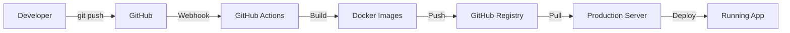

# CI/CD Setup Instructions

## 🚀 Quick Start Guide

Your monorepo is now configured with GitHub Actions CI/CD! Here's how to get it running:

### 1. **Update Image Names** (Required)

Edit `docker-compose.prod.yml` and replace placeholders:

```yaml
# Change these lines:
image: ghcr.io/YOUR_GITHUB_USERNAME/YOUR_REPOSITORY_NAME/server:latest
image: ghcr.io/YOUR_GITHUB_USERNAME/YOUR_REPOSITORY_NAME/client:latest

# To your actual values, for example:
image: ghcr.io/johndoe/my-fullstack-app/server:latest
image: ghcr.io/johndoe/my-fullstack-app/client:latest
```

### 2. **Push to GitHub** (Triggers First Build)

```bash
git add .
git commit -m "Add CI/CD pipeline for monorepo"
git push origin main
```

### 3. **Monitor Build Progress**

1. Go to your repository on GitHub
2. Click **Actions** tab
3. Watch the "Build and Push Monorepo Docker Images" workflow
4. Wait for ✅ completion (usually 5-10 minutes)

### 4. **Verify Images Were Created**

1. Go to your repository main page
2. Click **Packages** in the right sidebar
3. You should see:
   - `server` package
   - `client` package

## 📦 **What Gets Built Automatically**

### On Every Push to Main:
- ✅ **Server Docker image** from `./server/` folder
- ✅ **Client Docker image** from `./client/` folder  
- ✅ **Multi-platform builds** (AMD64 + ARM64)
- ✅ **Security scanning** with Trivy
- ✅ **Automatic tagging** (latest, commit SHA, branch name)

### Image Tags Created:
- `ghcr.io/username/repo/server:latest`
- `ghcr.io/username/repo/server:main`
- `ghcr.io/username/repo/server:main-abc1234` (commit SHA)
- `ghcr.io/username/repo/client:latest`
- `ghcr.io/username/repo/client:main`
- `ghcr.io/username/repo/client:main-abc1234`

## 🏗️ **Build Process Details**

### Server Build (from `./server/` folder):
1. **Multi-stage Dockerfile** for optimization
2. **Prisma client generation** 
3. **Production dependencies only**
4. **Non-root user** for security
5. **Health checks** included

### Client Build (from `./client/` folder):
1. **Multi-stage build** with Nginx
2. **React production build**
3. **Static asset optimization**
4. **SPA routing configuration**
5. **Security headers** added

## 🚀 **Production Deployment**

### Initial Server Setup:
```bash
# 1. Install Docker on your server
curl -fsSL https://get.docker.com | sh
sudo usermod -aG docker $USER

# 2. Clone your repository
git clone https://github.com/USERNAME/REPOSITORY.git
cd REPOSITORY

# 3. Setup environment
cp .env.production .env
nano .env  # Update with your production values

# 4. Update image names in docker-compose.prod.yml
nano docker-compose.prod.yml

# 5. Login to GitHub Container Registry
docker login ghcr.io -u YOUR_GITHUB_USERNAME
```

### Deploy Using Pre-built Images:
```bash
# Deploy latest images
./scripts/deploy-prod.sh

# Or manually:
docker compose -f docker-compose.prod.yml pull
docker compose -f docker-compose.prod.yml up -d
```

## 🔄 **Deployment Workflow**



## 🎯 **Available Deployment Commands**

```bash
# Full deployment (recommended)
./scripts/deploy-prod.sh deploy

# Check status
./scripts/deploy-prod.sh status

# View logs
./scripts/deploy-prod.sh logs

# Pull latest images only
./scripts/deploy-prod.sh pull

# Backup database
./scripts/deploy-prod.sh backup

# Rollback to specific version
./scripts/deploy-prod.sh rollback v1.0.0

# Update to specific tag
./scripts/deploy-prod.sh update main-abc1234

# Clean up old images
./scripts/deploy-prod.sh cleanup

# Restart services
./scripts/deploy-prod.sh restart

# Stop services
./scripts/deploy-prod.sh stop
```

## 🏷️ **Version Management**

### Release Deployment:
```bash
# Create a release tag
git tag v1.0.0
git push origin v1.0.0

# This creates:
# - ghcr.io/username/repo/server:v1.0.0
# - ghcr.io/username/repo/client:v1.0.0

# Deploy specific version
./scripts/deploy-prod.sh update v1.0.0
```

### Feature Branch Testing:
```bash
# Push feature branch
git push origin feature-auth

# Creates images tagged as:
# - ghcr.io/username/repo/server:feature-auth
# - ghcr.io/username/repo/client:feature-auth

# Test feature branch
./scripts/deploy-prod.sh update feature-auth
```

## 🔒 **Security Features**

- ✅ **Vulnerability scanning** with Trivy
- ✅ **Non-root containers** for security
- ✅ **Multi-stage builds** minimize attack surface
- ✅ **Automatic security updates** via GitHub
- ✅ **Resource limits** prevent resource exhaustion

## 📊 **Monitoring**

### Build Status:
- **GitHub Actions** tab shows build status
- **Packages** tab shows available images
- **Security** tab shows vulnerability reports

### Application Health:
```bash
# Check service health
docker compose -f docker-compose.prod.yml ps

# Monitor resource usage
docker stats

# View application logs
docker compose -f docker-compose.prod.yml logs -f
```

## 🛠️ **Troubleshooting**

### Build Failures:
1. Check **Actions** tab for error details
2. Verify Dockerfiles are valid
3. Check if all required files are in build context

### Deployment Issues:
1. Verify image names in `docker-compose.prod.yml`
2. Check GitHub Container Registry authentication
3. Ensure environment variables are set correctly

### Image Pull Failures:
```bash
# Test authentication
docker login ghcr.io -u YOUR_USERNAME

# Test image pull
docker pull ghcr.io/username/repo/server:latest
```

## 📞 **Support**

If you encounter issues:
1. Check the GitHub Actions build logs
2. Verify image names match your repository
3. Test authentication with GitHub Container Registry
4. Review the deployment script logs in `deploy-*.log` files

## 🎉 **Success Indicators**

You'll know everything is working when:
- ✅ GitHub Actions shows green checkmarks
- ✅ Packages appear in your repository
- ✅ Images can be pulled with `docker pull`
- ✅ Application deploys and passes health checks
- ✅ Frontend accessible at http://localhost:4172
- ✅ API responds at http://localhost:7999

Your monorepo CI/CD pipeline is now ready for production! 🚀
